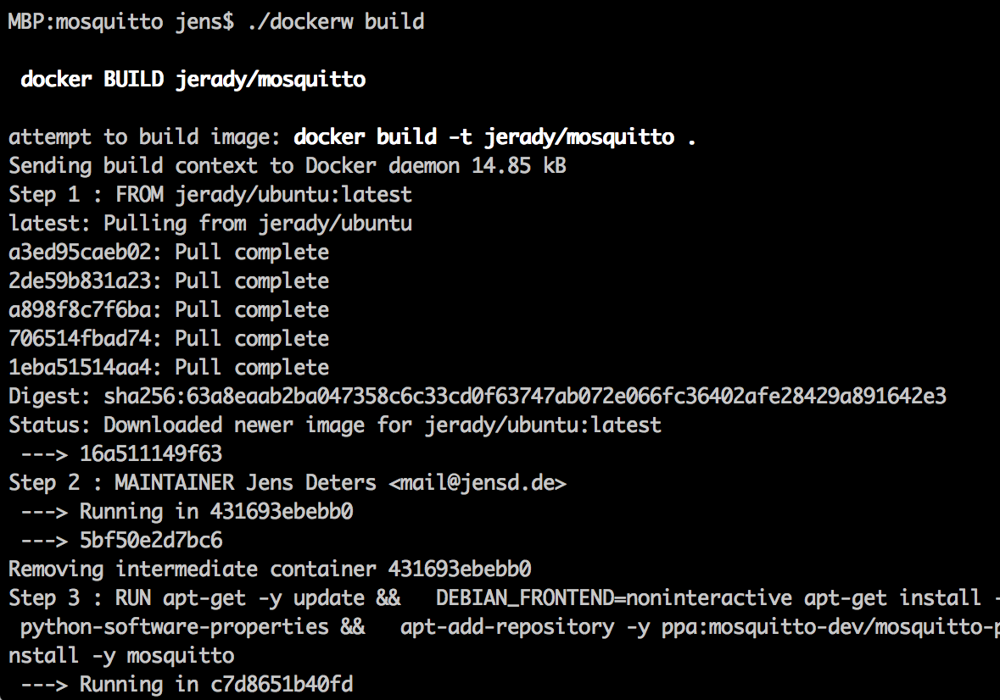
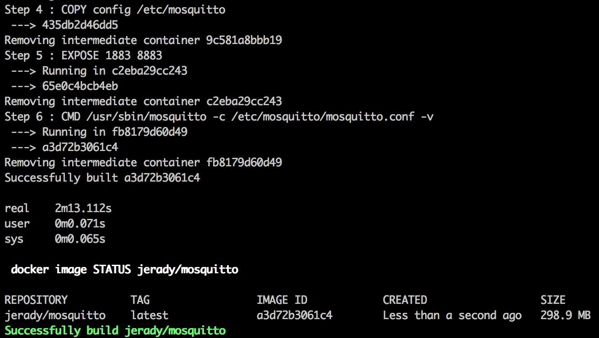
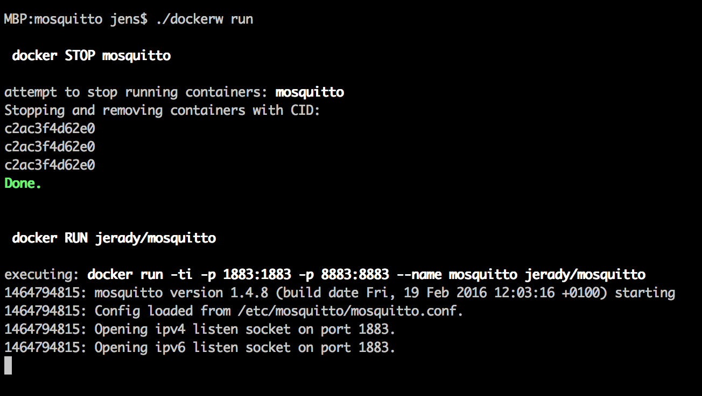
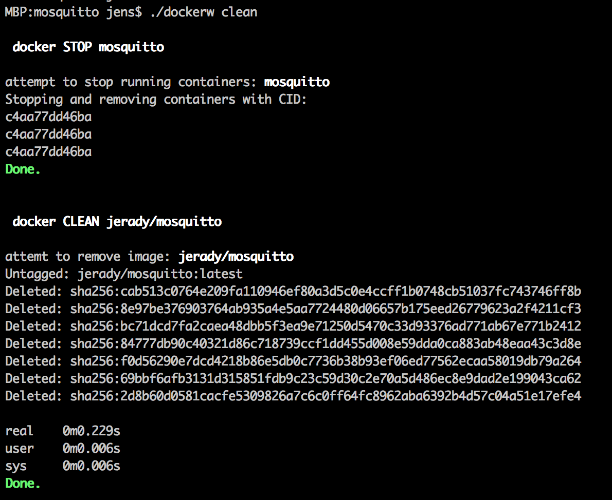
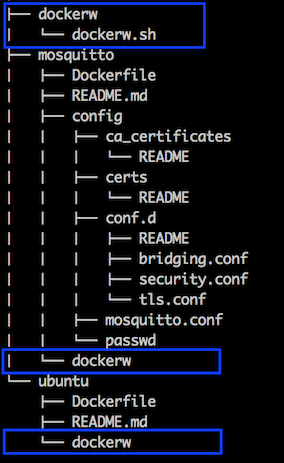
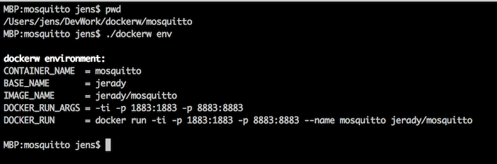

# dockerw
**A simple docker command wrapper for the rest of us.**

`dockerw` is a tool to support creating docker images. It aims to help you to build and (locally) run docker images and hides all the command line pain.

**Note:** `dockerw` targets only 'latest' tagged images (does not impact /touch implicit tagged images)! 

## Usage

`./dockerw [ build | run | stop | clean | status | env | help ]`

### build

[...]


### run


### clean



| Command | Description |
|:--------|:------------|
|`build` |builds the docker image   |
|`run`   |runs a docker container in foreground based on the image |
|`stop`  |stops all running container based on the image and removes them |
|`clean` |"stop" and then removes ALL (latest) images/artifacts |
|`status`|shows the status if the docker image
|`env`   |list current environment variables |
|`help`  |display help |


## Installation
1. Create a `dockerw` directory ahead your docker working dir and copy the `dockerw.sh` script to that location.
2. Copy a `dockerw` script located into the working dir of a docker image.
Using default values only the `dockerw` script is just calling the `dockerw.sh`:

```
#! /bin/bash

# call dockerw.sh, passing arguments and using env variables
. ../dockerw/dockerw.sh
```

You can overule the default environment like this:  

```
#! /bin/bash

# env
BASE_NAME="my_container_context"
CONTAINER_NAME="my_container"
DOCKER_RUN_ARGS="-ti -p 1883:1883 -p 8883:8883"

# call dockerw.sh, passing arguments and using env variables
. ../dockerw/dockerw.sh
```




## Conventions

The `CONTAINER_NAME` is the parent working directory base name.
The default base name (`BASE_NAME_DEFAULT`) and default docker run arguments (`DOCKER_RUN_ARGS_DEFAULT`) can be changed in dockerw.sh.
The image name (`IMAGE_NAME`) is build like this: `BASE_NAME_DEFAULT/CONTAINER_NAME` (e.g. jerady/ubuntu).


## Environment variables
| Name  | Description | Default |Example|
|:------|:------------|:--------|:------|
|`BASE_NAME`| the base name of the docker container |"jerady"| jerady
|`CONTAINER_NAME`| the name of the docker container|"$(`basename 'pwd'`)"| mosquitto
|`IMAGE_NAME`| the name of the docker image |"${`BASE_NAME`}/${`CONTAINER_NAME`}"| jerady/mosquitto
|`DOCKER_RUN_ARGS`| the arguments to run the container |"-ti"| -ti
|`DOCKER_RUN`| the docker run command to be called by ./dockerw run| "docker run ${`DOCKER_RUN_ARGS`} --name ${`CONTAINER_NAME`} ${`IMAGE_NAME`}" | docker run -ti --name mosquitto jerady/mosquitto



## Author
 **Jens Deters** // mail@jensd.de // [@jerady](https://twitter.com/Jerady) // [www.jensd.de](www.jensd.de) 
 
 (c) copyright 2016 Jens Deters